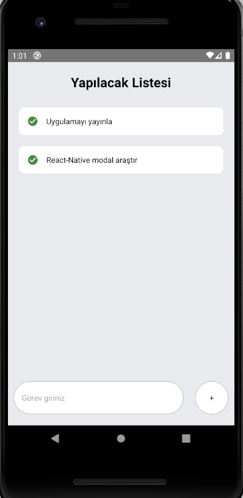

# ToDoApp
 ### React Native ile todo uygulaması yaptım. Yapılacakları input kısmına yazabilir sonra + tuşu ile listeye ekleyebilir, üzerine basınca silebilirsiniz.
 
 
<div>


</div>

 

## Projenin Çalıştırılması
Proje indirildikten sonra, 'Visual Studio Code' editörü ile proje açılır. 

  Terminalde;
```
npm install

```
komut satırı ile projede kullanılan paketler "node_modules" klasöründe oluşturulur.
```
npx react-native start
```
komutu çalıştırılır.
```
npx react-native run-android
```
komutu çalıştırılır.